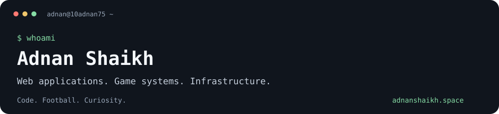
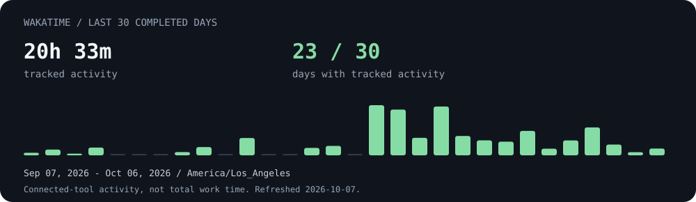

# Hey, I'm Adnan

I build web applications, game systems, and the infrastructure underneath them. I like figuring out why something breaks, making it easier to reason about, and writing the test that keeps it fixed.

**MS Computer Science, USC · Software Developer at Easley-Dunn Productions · Los Angeles**

[Portfolio](https://adnanshaikh.space/) · [LinkedIn](https://www.linkedin.com/in/10adnan75/) · [Resume](https://adnanshaikh.space/ams-resume.pdf) · [Email](mailto:hey@adnanshaikh.space)

## What I'm working on

- **Monster Gridiron:** card collection and pack-opening systems in Unity/C#, shared player identity, and integration tests across game services. [A merged scene-testing contribution →](https://github.com/MGIintegration/MGI_Monorepo/pull/88)
- **Squad Space:** real-time collaboration with Spring Boot, React, TypeScript, PostgreSQL, and WebRTC. Rooms, video, screen sharing, collaborative coding, and whiteboarding.
- **Systems engineering:** distributed storage, networking, and the failure cases that make a design interesting.

## Selected work

| Project | What I explored | Stack |
| :--- | :--- | :--- |
| [Adnan OS](https://adnanshaikh.space/) | My interactive portfolio, with terminal and desktop interfaces | Web development |
| [HTTP server](https://github.com/10adnan75/http-server) | HTTP over TCP, GET/POST, file serving, and concurrent connections | Java |
| [DNS server](https://github.com/10adnan75/dns-server) | DNS packets, UDP, and query/response handling | Java |
| [Shell](https://github.com/10adnan75/shell) | Command execution, pipelines, redirection, and completion | Java |
| [Fake review detection](https://github.com/10adnan75/undergraduate-thesis) | A team research project on identifying fake Amazon product reviews | Python, ML, web integration |

I've also worked on a Raft/CURP key-value store in C++, an educational Weenix kernel in C, and learned-indexing experiments. More context is in my [portfolio](https://adnanshaikh.space/projects/) and [resume](https://adnanshaikh.space/ams-resume.pdf).

## Open source

A few merged contributions:

- **[AgenTrust CA2A #80](https://github.com/agentrust-io/ca2a/pull/80):** added three conformance tests for multi-hop delegation, scope widening, and subject/credential binding.
- **[DiceDB #1680](https://github.com/dicedb/dicedb/pull/1680):** made client-state updates and watcher notifications conditional on successful command execution.
- **[Pi-hole #6530](https://github.com/pi-hole/pi-hole/pull/6530):** removed the deprecated `arpflush` command.
- **[Pi-hole #6531](https://github.com/pi-hole/pi-hole/pull/6531):** removed a misleading TODO suggesting the removal of the interactive password wrapper; runtime behavior stayed unchanged.

## AI in my work

I use **Codex, ChatGPT, Cursor, Antigravity, Grok, and Muse** in my development workflow, including AI-assisted work on my portfolio. I'm also interested in the reliability and authorization boundaries around AI agents: my CA2A contribution tests how delegated permissions and action evidence behave across multiple hops.

The engineering questions I care about are concrete: what is the system allowed to do, how do we test that boundary, and what happens when an assumption fails?

## Experience

| Where | What I worked on |
| :--- | :--- |
| **Easley-Dunn Productions** · Software Developer | Unity/C# game services, player identity, automated testing, and code review |
| **USC Games** · Graduate Teaching Assistant | Game development mentoring, debugging, and collaborative Git workflows |
| **USC Auxiliary Services** · Full Stack Engineer | React, Flask, Docker, and CI/CD improvements |
| **Lumina AI Health Institute** · Software Engineer Intern | Parking detection, Next.js/FastAPI, GCP, and RTSP-to-WebRTC streaming |
| **Persistent Systems** · Software Development Engineer | React/.NET insurance applications, SQL data migration, and query optimization |

## Tools I work with

**Languages:** Java · Python · C# · C/C++ · Go · TypeScript · SQL  
**Applications:** React · Next.js · Spring Boot · Flask · FastAPI · .NET · Unity  
**Data and delivery:** PostgreSQL · MSSQL · MongoDB · Docker · GCP · GitHub Actions · Linux

## Recent coding activity

<!-- WAKATIME:START -->

<!-- WAKATIME:END -->

*WakaTime tracks activity reported by connected tools. It does not capture all design, review, debugging, or AI-assisted work, and it is not a productivity score.*

---

Outside the editor: football. Inside the editor: probably tracing one more bug.

[Say hey →](mailto:hey@adnanshaikh.space)
