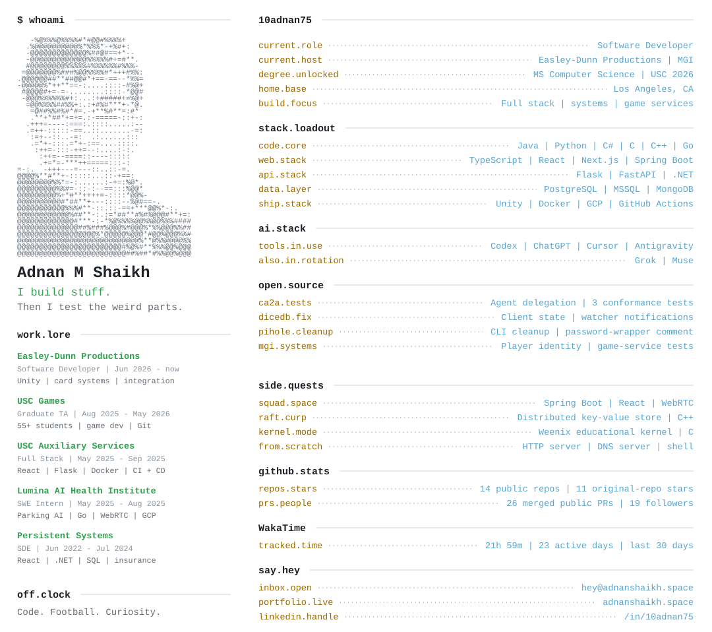

<picture>
  <source media="(prefers-color-scheme: dark)" srcset="assets/profile-dark.svg">
  
</picture>

[portfolio.live](https://adnanshaikh.space/) · [resume.pdf](https://adnanshaikh.space/ams-resume.pdf) · [linkedin.me](https://www.linkedin.com/in/10adnan75/) · [inbox.open](mailto:hey@adnanshaikh.space)

<strong>hire.context</strong> | the work behind the terminal

I build web applications, game systems, and the infrastructure underneath them. My experience spans full-stack development, production databases, cloud deployment, video streaming, and automated testing. I'm especially interested in how systems behave when components fail or disagree about state.

**work.lore**

| Role | Dates | My contribution |
| :--- | :--- | :--- |
| Software Developer · Easley-Dunn Productions | Jun 2026–present | Monster Gridiron's card collection and pack-opening system in Unity and C#; shared player identity; unit, integration, and scene smoke tests. |
| Graduate Teaching Assistant · USC Games | Aug 2025–May 2026 | Mentored 55+ students in game development and collaborative Git workflows; developed an HLSL mesh-reveal shader. |
| Full Stack Engineer · USC Auxiliary Services | May–Sep 2025 · part-time | React and Flask web development, Docker containerization, and CI/CD improvements. |
| Software Engineer Intern · Lumina AI Health Institute | May–Aug 2025 | ParkSense.ai web services, GCP deployment, and camera-to-browser streaming with Go, RTSP, and WebRTC. |
| Software Development Engineer · Persistent Systems | Jun 2022–Jul 2024 | React and .NET insurance applications, SQL data migration, query optimization, and wellness features. |

**degree.unlocked**

- MS in Computer Science, University of Southern California, 2026.
- BTech in Computer Science and Engineering, Walchand Institute of Technology, 2022.

**side.quests**

- **Squad Space:** real-time collaboration with Spring Boot, React, TypeScript, PostgreSQL, and WebRTC.
- **Raft–CURP key-value store:** distributed storage, request deduplication, and leader-crash recovery in C++.
- **Weenix:** educational operating-system work in C, including virtual memory, system calls, scheduling, and filesystems.
- **Learned indexing:** experiments with ALEX, polynomial regression, and DuckDB.
- **Protocol implementations:** [HTTP server](https://github.com/10adnan75/http-server), [DNS server](https://github.com/10adnan75/dns-server), and a [shell](https://github.com/10adnan75/shell).
- **Undergraduate research:** [fake Amazon review detection](https://github.com/10adnan75/undergraduate-thesis), a team ML project.
- **[Adnan OS](https://adnanshaikh.space/):** my portfolio with terminal and desktop interfaces.

**ai.stack**

I use Codex, ChatGPT, Cursor, Antigravity, Grok, and Muse in my development workflow, including AI-assisted portfolio work. My CA2A contribution adds tests for multi-hop agent delegation, scope widening, and subject-to-credential binding. It is conformance-test coverage, not authorship of the entire protocol.

<strong>open.source</strong> | every public PR to other repositories

This index includes my public PRs to repositories owned by other users and organizations, including MGI work and collaboration on AVIS. Merged, open, and closed-without-merge entries are labelled separately. It excludes PRs to my own repositories; it is not a list of all my GitHub activity or a claim about each repository's license.

<!-- CONTRIBUTIONS:START -->
**[agentrust-io/ca2a](https://github.com/agentrust-io/ca2a)**

- [#80](https://github.com/agentrust-io/ca2a/pull/80) | test(conformance): cover multi-hop action evidence boundaries | **merged**

**[dicedb/dicedb](https://github.com/dicedb/dicedb)**

- [#1680](https://github.com/dicedb/dicedb/pull/1680) | fix: Condition ClientID updates and watcher notifications on command success | **merged**
- [#1679](https://github.com/dicedb/dicedb/pull/1679) | Second &#96;sponsor&#96; badge changed to plural form | **merged**
- [#1678](https://github.com/dicedb/dicedb/pull/1678) | changed the logo label to &#96;sponsors&#96; in README.md | **merged**

**[MGIintegration/MGI_Monorepo](https://github.com/MGIintegration/MGI_Monorepo)**

- [#89](https://github.com/MGIintegration/MGI_Monorepo/pull/89) | Standardize active player identity across game systems | **open**
- [#88](https://github.com/MGIintegration/MGI_Monorepo/pull/88) | Add automated CCAS scene smoke tests | **merged**
- [#87](https://github.com/MGIintegration/MGI_Monorepo/pull/87) | Apply Unity test-runner follow-up improvements | **merged**
- [#86](https://github.com/MGIintegration/MGI_Monorepo/pull/86) | Keep generated test reports out of source control | **merged**
- [#85](https://github.com/MGIintegration/MGI_Monorepo/pull/85) | Make Unity test runner path configurable | **merged**
- [#75](https://github.com/MGIintegration/MGI_Monorepo/pull/75) | test(ccas): cover Facilities and Coaches XP boundary | **merged**
- [#74](https://github.com/MGIintegration/MGI_Monorepo/pull/74) | chore(ccas): add Figma screenshot capture menu | **merged**
- [#71](https://github.com/MGIintegration/MGI_Monorepo/pull/71) | test(ccas): add Progression integration coverage | **merged**
- [#70](https://github.com/MGIintegration/MGI_Monorepo/pull/70) | fix(ccas): clear persisted drop history on reset | **merged**
- [#66](https://github.com/MGIintegration/MGI_Monorepo/pull/66) | test(ccas): add Economy pack-purchase integration coverage | **merged**
- [#65](https://github.com/MGIintegration/MGI_Monorepo/pull/65) | fix(ccas): make title-screen reset available before CCAS loads | **merged**
- [#61](https://github.com/MGIintegration/MGI_Monorepo/pull/61) | test(ccas): add reset/seed controls and service coverage | **merged**
- [#56](https://github.com/MGIintegration/MGI_Monorepo/pull/56) | fix(ccas): standardize player ID with PlayerIdProvider | **merged**
- [#51](https://github.com/MGIintegration/MGI_Monorepo/pull/51) | Add back-to-hub button functionality in PackOpeningController | **merged**

**[pi-hole/pi-hole](https://github.com/pi-hole/pi-hole)**

- [#6532](https://github.com/pi-hole/pi-hole/pull/6532) | Fix readonly variable error in network flush (Docker) | **closed without merge**
- [#6531](https://github.com/pi-hole/pi-hole/pull/6531) | Remove misleading TODO comment for SetWebPassword | **merged**
- [#6530](https://github.com/pi-hole/pi-hole/pull/6530) | Remove deprecated arpflush command in favor of networkflush | **merged**

**[shivarajbhanji/AVIS](https://github.com/shivarajbhanji/AVIS)**

- [#2](https://github.com/shivarajbhanji/AVIS/pull/2) | Background Scoring Loop | **merged**
<!-- CONTRIBUTIONS:END -->

<strong>stats.context</strong> | what the numbers mean

Public repos include forks. Stars count only my non-fork repositories. Merged PRs include public PRs I authored in both my own and others' repositories. Followers come from my public GitHub profile.

WakaTime covers the last 30 completed calendar days in America/Los_Angeles. An active day has more than zero reported seconds. Connected tools do not capture all design, review, debugging, or AI-assisted work; tracked time is not a productivity score. The cards refresh through GitHub Actions and retain their previous data if an update fails. The latest successful update can be checked in [workflow runs](https://github.com/10adnan75/10adnan75/actions/workflows/update-profile.yml).
